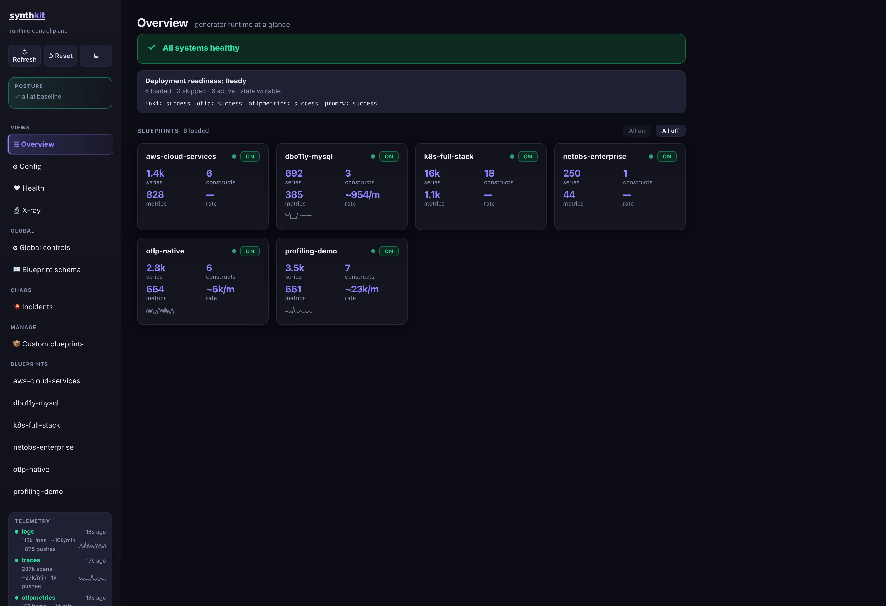
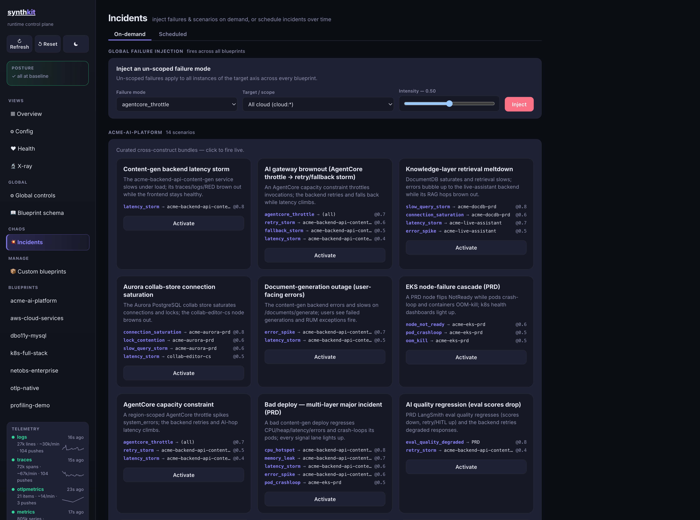
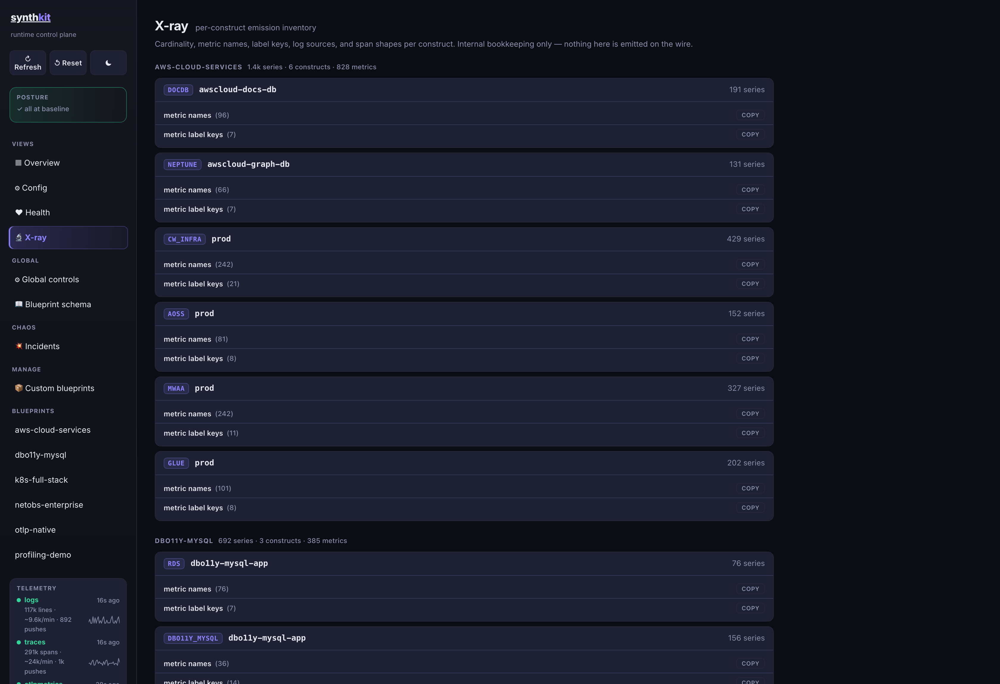

# synthkit

[](https://scorecard.dev/viewer/?uri=github.com/rknightion/synthkit)

**Get a realistic, Grafana-visible metrics, logs, and traces environment from one YAML blueprint — without deploying a real application.**

**[Documentation](https://m7kni.io/synthkit/)** — installation, blueprint reference and the signal catalog.

Composable synthetic-telemetry generator for Grafana Cloud. Declare a model of the infrastructure
and applications you want in one YAML **blueprint** — synthkit does not deploy those applications
or infrastructure — and it emits structurally-correct
synthetic metrics, traces, and logs (plus optional Faro/RUM) with the REAL metric/label/field
names of each technology it models: EKS + the k8s-monitoring substrate, EC2/ALB/NAT-gateway/EBS/
S3 CloudWatch families, RDS/ElastiCache, Database Observability (MySQL/Postgres), Azure/GCP CSP,
Cloudflare, Synthetic Monitoring, Fleet Management, and correlated request workloads — `web_service`
(a single service) and `app` (a declared multi-service GRAPH whose nodes emit custom metrics/logs/
spans via a telemetry DSL) — sharing one end-to-end correlation ID per request across the graph.

- **Catalog**: isolated construct/workload modules, each with a verified signal contract
  ([SIGNALS.md](./SIGNALS.md)).
- **Composition**: a blueprint is one deletable YAML file; constructs know nothing about it.
  See [ARCHITECTURE.md](./ARCHITECTURE.md).

## The runtime control plane

Every deployment serves an operator UI at `/control/ui` — live per-blueprint emission rates, a
per-construct cardinality inventory, and on-demand failure injection.



Curated incident scenarios fire correlated failures across constructs — a bad deploy, a node-failure
cascade, a retrieval meltdown — so a dashboard or alert can be demonstrated against a real signal.



The X-ray view accounts for every series before it leaves the process: metric names, label keys and
cardinality per construct.



## Quick start

```bash
go build ./cmd/synthkit

# Dry run: select one bundled blueprint and print its series/label inventory, push nothing
DRY_RUN=true BLUEPRINT_NAMES=otlp-native ./synthkit -once -dump

# Live: create a private env file, fill the required Grafana Cloud values,
# and explicitly set DRY_RUN=false before starting
if test -e .env; then
  printf '%s\n' '.env already exists; review it before changing live-mode settings.' >&2
else
  install -m 600 .env.example .env
  ./plugins/synthkit/skills/initial-setup/scripts/set-env.sh DRY_RUN false .env
fi
# Edit .env and fill the required Grafana Cloud values plus an exact BLUEPRINT_NAMES selection
# without printing secrets.
./synthkit

# From another terminal; this must print true
curl -fsS http://localhost:8088/control/status | jq -e '.dry_run == false'
```

## LLM-assisted setup (Claude Code / Codex / OpenCode)

synthkit ships agent skills for deployment and operation. In **Claude Code**, open this repo and run
`/initial-setup` (also `/verify-deployment`, `/create-blueprint`,
`/setup-fleet-management`). Or install as a plugin from anywhere:

    /plugin marketplace add rknightion/synthkit
    /plugin install synthkit@synthkit      # → /synthkit:initial-setup, etc.

The same skills work in **Codex** (`.agents/skills/`) and **OpenCode** (reads `.claude/skills/`).
Skills are authored once under `plugins/synthkit/skills/`; `.claude/skills` and `.agents/skills` are
symlinks kept in sync by `just skills-sync` (verified by `just skills-check`).

## Synthetic Monitoring — two-phase startup

Blueprints with `synthetic_monitoring` blocks use a snapshot-bound one-shot control-plane step.
Start the emitter once to write the private snapshot, preview/apply the version-matched Docker job,
then restart the emitter to activate the matching registration:

```bash
docker compose up -d synthkit
docker compose --profile sm-provision run --rm sm-provision
```

Review the printed preview plan. Only then authorise the remote changes and restart the emitter:

```bash
SM_PROVISION_APPLY=true docker compose --profile sm-provision run --rm sm-provision
docker compose restart synthkit
```

Preview is the default and makes no remote mutation. `DRY_RUN` does not authorise the provisioner.
Foreign collisions and ambiguous/pending operations fail closed; resources are never deleted.
The probe name, region, and Frankfurt coordinates are shared constants in `internal/construct/sm`
so data-plane and control-plane cannot drift.

## Authoring a blueprint

Copy `blueprints/k8s-minimal.yaml`, rename it, and declare the environments, clusters, databases,
and synthetic workloads you want to model. This is a telemetry model, not a deployment manifest:
synthkit does not create pods, databases, or application code. The schema is documented in
ARCHITECTURE.md §3; unknown constructs or fields fail loudly at load. Deleting your blueprint file
removes its telemetry and affects nothing else.

A fresh synthkit process selects no blueprints and emits no synthetic telemetry. Set
`BLUEPRINT_NAMES` to one or more exact names before starting (for example,
`BLUEPRINT_NAMES=otlp-native`); `BLUEPRINT_NAMES=*` is the explicit all-catalog opt-in.

```yaml
name: mine
environments:
  - name: prod
    cloud:   { provider: aws, account_id: "210987654321", region: eu-west-1, vpc_id: vpc-0mine01 }
    cluster: { type: eks, name: mine-prod-euw1, addons: [core_dns, ebs_csi] }
    databases: [{ engine: postgres, version: "16.2", name: mine-db, observability: { mode: dbo11y } }]
workloads:
  - { type: web_service, name: mine-api, runs_on: mine-prod-euw1,
      traffic: { off_peak_rps: 5, peak_rps: 40 },
      endpoints: [{ route: "GET /v1/ping", error_rate: 0.01, p95_ms: 80 }] }
```

## Incident scenarios

Declare named, reusable failure bundles in a blueprint, then fire them on a schedule or live via
the control plane. Each effect names a mode, an optional target (instance name, `<axis>:*` wildcard,
or omitted for a single-axis mode), and an intensity in [0,1].

```yaml
scenarios:
  - name: db-pressure
    title: "Database under load"
    summary: "Connection saturation + slow queries hitting the production DB"
    effects:
      - { mode: connection_saturation, target: mine-db, intensity: 0.7 }
      - { mode: slow_query_storm,      target: mine-db, intensity: 0.5 }

incidents:
  # Schedule the whole scenario:
  - { scenario: db-pressure, at: "2026-06-19T14:00", for: 30m }
  # Or fire a single mode directly:
  - { kind: oom_kill, target: mine-prod-euw1, at: "2026-06-20T10:00", for: 10m, intensity: 0.6 }
```

Scenarios can also be activated or deactivated live without a restart — see **Control plane** below.

## Control plane

The control plane (`GET /control/ui`, `GET /control/schema`, `GET /control/state`) is available
by default. Mutation routes require `CONTROL_TOKEN` when set.

For the mutation examples below, run this once in Bash or Zsh. When `CONTROL_TOKEN` is set it writes
credentials to a mode-0600 temporary netrc file, keeping the token out of process arguments. When
the token is unset, requests remain unauthenticated:

```bash
control_auth=()
control_netrc=
if [ -n "${CONTROL_TOKEN:-}" ]; then
  control_netrc="$(mktemp)"
  chmod 600 "$control_netrc"
  printf 'machine localhost login control password %s\n' "$CONTROL_TOKEN" > "$control_netrc"
  control_auth=(--netrc-file "$control_netrc")
  trap 'test -z "$control_netrc" || rm -f "$control_netrc"' EXIT
fi
```

| Route | Method | Description |
|---|---|---|
| `/control/schema` | GET | Blueprint-derived schema: all modes, addressable targets, scenarios, live scaling state. |
| `/control/state` | GET | Current control snapshot (volume multiplier, active scenarios, failures, scaling). |
| `/control/scenarios` | POST | Replace the active scenario list using qualified `blueprint/scenario` IDs. Prefer the item routes for ordinary activation/deactivation. |
| `/control/scaling` | POST | Set live workload pod counts using qualified `blueprint/workload` IDs, within blueprint-declared bounds. Node count cascades automatically. |
| `/control/failures` | POST | Ad-hoc `{mode → {enabled, intensity, scope}}` override (escape hatch; unknown modes warned, not rejected). |
| `/control/load` | POST | Master volume multiplier — scales all synthetic volume coherently. |

**Example — activate a scenario:**

```bash
curl -fsS "${control_auth[@]}" -X POST http://localhost:8088/control/scenarios/activate \
  -H "Content-Type: application/json" \
  -d '{"scenario": "mine/db-pressure"}'
```

**Example — scale workload pods live:**

```bash
curl -fsS "${control_auth[@]}" -X POST http://localhost:8088/control/scaling \
  -H "Content-Type: application/json" \
  -d '{"mine/mine-api": 8}'
# Node count cascades: k8scluster + ec2 both re-derive via fixture.DeriveNodes.
# Scale-down retires old pod/node series automatically (state.DropWhere).
```

## Status

v1 catalog + composition + platform complete and green (`go build ./... && go vet ./... && go test ./...`):
21 construct kinds + the `web_service` and `app` workloads, the blueprint loader/resolver, the two-cadence runner,
the control plane + operator UI, the Infinity JSON host, and the SM provisioner. The signal contracts are
lifted from a proven production-shaped generator with full provenance citations ([SIGNALS.md](./SIGNALS.md)).
Open items are tracked in [cantfind.md](./cantfind.md). The live-push end-to-end path is validated
(metrics, traces, logs, and Fleet collectors confirmed in Grafana Cloud) — see
[docs/RUNBOOK.md](./docs/RUNBOOK.md) for the credentials→telemetry runbook.

## License

`synthkit` is licensed under the GNU Affero General Public License v3.0 only (`AGPL-3.0-only`).
See [LICENSE](./LICENSE) and [LICENSING.md](./LICENSING.md). Every Go source file carries an
`SPDX-License-Identifier: AGPL-3.0-only` header.
