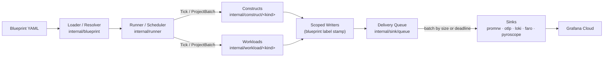

# Architecture

synthkit is built around a strict three-tier design: isolated construct/workload modules that know nothing about blueprints, a declarative YAML blueprint layer that is the only home for blueprint-specific config and wiring, and a composition root (`internal/runner`) that instantiates everything via an explicit registry. The full invariant text lives in [ARCHITECTURE.md on GitHub](https://github.com/rknightion/synthkit/blob/main/ARCHITECTURE.md).

## The three tiers

```text
BLUEPRINT (YAML)            recipe + wiring: a bill-of-materials of construct + workload
   │                        instances with config. The ONLY place blueprint-specific config lives.
   │ load → validate →
   │ resolve fixtures
   ▼
COMPOSITION ROOT (runner)   instantiates the BoM via the explicit registry, builds the
   │                        per-blueprint ledger + scoped sink writers, runs the scheduler.
   │ Build(cfg, fixtures)
   ▼
CONSTRUCTS ⊥ WORKLOADS      isolated modules. Constructs render infrastructure telemetry.
                            Workloads mint and project correlated request telemetry via the ledger.
                            Neither knows blueprints or each other exist.
```

**Constructs** (`internal/construct/<kind>/`) emit infrastructure telemetry — metrics, logs, traces — for the technology they model (EC2, RDS, a Kubernetes cluster, etc.). **Workloads** (`internal/workload/<kind>/`) emit request-correlated telemetry across the call graph declared in the blueprint. Both are independently compilable packages with zero imports of each other or of the blueprint package — enforced by `internal/archtest`.

**The composition root** (`internal/runner`) is where everything is wired together. It uses an explicit catalog registry (no `init()` self-registration, no global registries). The YAML loader validates every construct, addon, workload, and feature kind against that registry — an unknown kind or unknown field is a loud load error.

## Frozen seams

The interfaces that constructs and workloads implement are frozen. Changes to these are a wiring event that touches the entire catalog.

### Construct interface

```go
type Construct interface {
    Kind() string                 // registry key, snake_case
    Signals() []SignalClass       // Metrics | Traces | Logs | RUM | PyroscopeProfiles
    Interval() time.Duration      // tick cadence; metric lanes ≥60s (DPM floor)
    Tick(ctx context.Context, now time.Time, w *World) error
}
```

### Workload interface

```go
type Workload interface {
    Kind() string
    Name() string
    Signals() []SignalClass
    Interval() time.Duration
    Minter() ledger.Minter       // contributes request volume to the blueprint's ledger
    Tick(...)  error              // metric lane
    ProjectBatch(..., batch []*ledger.Request) error  // trace/log/RUM lane
}
```

### World — what every Tick receives

The `World` struct is handed to every `Tick` and `ProjectBatch`. Writers are `nil` for signal classes the instance did not declare in `Signals()`.

```go
type World struct {
    Shape    *shape.Engine   // diurnal plateau × weekly × noise × incidents
    Metrics  MetricWriter    // pre-scoped: stamps blueprint label iff ScopeBlueprint
    Logs     LogWriter       // Loki 3-tuple; sink asserts no high-card stream label
    Traces   TraceWriter     // OTLP ResourceSpans — traces only
    Pyroscope PyroscopeWriter
    Ledger   *ledger.Ledger  // workloads only; constructs receive nil
}
```

### Fixtures — shared identity vocabulary

`internal/fixture` defines the shared-identity types: `Env`, `Cloud`, `Cluster`, `Node`, `DB`, `Cache`, and `CallTarget`. All identity is deterministic — sha256 of stable seeds derived from `"<blueprint>:<path>"` strings. The same blueprint produces the same hostnames, instance IDs, and database names on every run.

The **topology resolver** (part of the blueprint loader) builds fixtures once and hands them to every construct that shares an identity: the same `fixture.Node` is handed to both the `ec2` construct and the `k8s_cluster` construct; the same `fixture.DB` goes to both `rds` and `dbo11y_postgres`. This is the cross-construct join mechanism.

### Ledger — end-to-end request correlation

The ledger (`internal/ledger`) is the source of all request-scoped IDs. Constructs never mint IDs; only the ledger does.

Each `Request` carries a `Correlation` struct: `CorrelationID`, `TraceID`, `SpanID`, `BrowserSpanID`, `SessionID`, `RequestID`. Workloads read these when projecting their trace/log/RUM lanes. The same correlation IDs flow from the browser span through backend spans to DB spans — one end-to-end correlated request per mint.

Spans are **backdated to completion**: `RenderStart = Start − Duration − RenderOffset`, so spans export ending at approximately `now`, matching how real spans export on completion. Ledger windowing still keys on `Start`.

## The two-cadence scheduler

Each blueprint runs on its own goroutine. Two cadences run per blueprint:

- **Master tick (fast, default 5 s)**: `Ledger.Mint(now)` returns the request batch for this tick. The runner immediately calls each workload's `ProjectBatch` with its own minted requests — traces, logs, and RUM are emitted exactly once, unfloored.
- **Metric lanes (≥60 s)**: every construct and workload calls its own `Tick` on its declared `Interval()`. Workload metric lanes call `Ledger.ActiveFor(name, now, interval)` to read the window of recently-minted requests.

Blueprint goroutines share nothing but the concurrency-safe sinks. A slow or hung push on one blueprint cannot delay another's cadence.

## Scoping: blueprint vs substrate

Constructs are registered as either `ScopeBlueprint` or `ScopeSubstrate`.

- **Blueprint-scoped** constructs carry a `blueprint=<label>` selector on every series and stream, stamped by the scoped writer (never by the construct). Applies to: workload signals, CloudWatch families, Cloudflare.
- **Substrate-scoped** constructs carry no `blueprint` label. They follow vendor-conformant label shapes; disambiguation comes from declared identity (cluster name, account_id, dbo11y instance). Applies to: k8s-monitoring, k8s addons, dbo11y, CSP Azure/GCP, Synthetic Monitoring, Fleet Management.

Cross-scope joins work because shared fixture identity is globally unique (collision-checked at load). A node's substrate k8s metrics and its blueprint-scoped EC2 CloudWatch metrics share the same `fixture.Node.InstanceID`, so they join unambiguously.

## Data flow



Delivery is **decoupled from emission**. Each scoped writer enqueues to an in-memory delivery queue (`internal/sink/queue`). Background senders batch by size or deadline before calling the real sink. A slow remote never stalls the tick cadence.

## Sinks

| Sink | Carries | Wire format |
|---|---|---|
| `sink/promrw` | All metrics | Prometheus Remote-Write v2 (`io.prometheus.write.v2.Request`), proto vendored under `internal/sink/promrw/writev2`, snappy-compressed. Final pre-mangled names. OTel metrics SDK banned on the synthetic path. |
| `sink/otlp` | Traces only | Hand-encoded ResourceSpans protobuf. Never the OTel SDK. |
| `sink/loki` | Logs | 3-tuple `[ts, line, {meta}]`; asserts no high-card key in stream labels. |
| `sink/faro` | RUM beacons | POST to Faro collector with app key (optional — requires `GC_FARO_*`). |
| `sink/pyroscope` | Synthetic profiles | push.v1 connect-unary, hand-built pprof protos, no pyroscope-go SDK. |

**Counters and histograms are cumulative across ticks** — the sink pushes running totals, never deltas. CloudWatch `_sum` series are per-period gauges (never `rate()`).

**Native histograms** are used only for span-metric families (`traces_spanmetrics_latency`, `traces_service_graph_request_*`), dual-emitted alongside classic `_bucket` form.

## Self-observability

`internal/selfobs` is the **sole** OTel SDK user in the repository. It instruments the synthkit **process** — push RED metrics, Go runtime metrics, per-tick traces — and ships to a **separate** Grafana Cloud stack via its own credential triplet (`GC_SELF_OTLP_*`). It never touches the synthetic-data path. Default off; enabled via `SELFOBS_ENABLED=true` on a live (non-dry-run) instance. See [self-observability.md](self-observability.md).

## Invariant summary

The full invariant text (I1–I41) is in [ARCHITECTURE.md on GitHub](https://github.com/rknightion/synthkit/blob/main/ARCHITECTURE.md). Key invariants by group:

| Group | Key rules |
|---|---|
| **Metrics** | All metrics via Remote-Write v2 with final pre-mangled names (I1). OTel metrics SDK banned on the synthetic path. OTLP carries traces only (I2). Counters/histograms are cumulative (I3). CloudWatch `_sum` series are gauges, never `rate()` (I5). |
| **Identity** | Request-scoped IDs minted only by the ledger (I9). Two cadences: fast master mint, ≥60 s metric tick (I10). Fixtures are deterministic from stable seeds (I12). Absent dimensions are omitted — never `""` or `"NA"` (I13). |
| **Cardinality** | UUID-class keys are never Mimir labels or Loki stream labels (I14). Blueprint selector stamped in exactly one place, clone-before-stamp (I17). |
| **Composition** | Constructs contain zero blueprint-name references (I18). Nothing derived from a blueprint's positional index (I19). Scope is explicit per construct kind (I21). |
| **Ops** | `DRY_RUN=true` default. Generators write to explicit `--out` paths, never stdout redirect (I28). Control-plane JSON round-trips zero/false — no `omitempty` on knobs (I24). |
| **Self-obs** | `internal/selfobs` is the sole OTel SDK user, ships to a separate stack, reaches the synthetic path only through two stdlib-only seams (I34). Constructs/workloads never import the SDK, selfobs, or profiling. |
