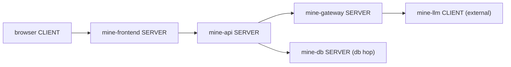

# Workloads

A workload is the request-generating layer of a blueprint. Where constructs emit infrastructure telemetry on a fixed tick, a workload mints correlated request samples per master tick and projects them across traces, logs, and optionally RUM — threading one correlation key-set through every signal class so a trace ID in a span matches the same ID in the application log and the browser beacon.

Two workload kinds exist:

- **`web_service`** — a single service: a browser→backend→DB hop tree with optional gen_ai/LLM hops, RUM, Beyla, and profiling. Simple and common.
- **`app`** — a blueprint-declared service graph of typed nodes, each with its own custom metrics/logs/spans via the telemetry DSL, and one end-to-end correlated trace across the whole graph. Use when you need multiple backend services each with distinct telemetry, per-service incident targeting, or per-service scaling.

The two kinds may coexist in one blueprint: model the core correlated flow as an `app`, and simpler peripheral services as standalone `web_service` workloads.

## web_service

`web_service` models a single backend service. One minted request produces:

- A **trace**: optional browser CLIENT root span → backend SERVER span → one CLIENT span per downstream call (database or cache hops, with `db.*` semantic conventions). Traces are backdated so they end at approximately `now`, matching how real spans export on completion.
- **Application logs**: one structured log line per request, correlated by trace/span ID.
- **APM span-metrics**: `traces_spanmetrics_*` histograms + service-graph series on the 60-second metric tick.
- Optional **Faro/RUM beacons** when `rum: true` and `GC_FARO_*` credentials are present.
- Optional **Beyla eBPF** observation lane when `observability.beyla` is set.
- Optional **Pyroscope SDK-push profiles** when `pyroscope:` is set with `mode: sdk`.
- Optional **native OTLP application metrics** (`http.server.*`) when `otel.metrics: true`.

### Key fields

```yaml
workloads:
  - type: web_service
    name: mine-api
    runs_on: mine-prod-use1      # binds to a cluster by its declared name
    tracing: true                # default true; false omits the OTLP lane
    rum: true                    # requires GC_FARO_* creds; omit or false = disabled
    traffic:
      off_peak_rps: 10           # trough request rate (default 5)
      peak_rps: 80               # plateau request rate (default 50)
    endpoints:
      - { route: "GET /v1/search",  error_rate: 0.01, p95_ms: 140 }
      - { route: "POST /v1/items",  error_rate: 0.02, p95_ms: 220 }
    calls:
      - { db: mine-app-db }      # resolved to the named database fixture
      - { cache: mine-sessions } # resolved to the named cache fixture
```

`traffic` drives the **metric lane** volume (span-metrics RPS). The correlation narrative (one request per master tick) is separate and smaller by design — it seeds realistic trace/log samples without inflating span-metric series cardinality.

`endpoints` are drawn uniformly across each minted request; `error_rate` and `p95_ms` shape the per-route latency distribution and error fraction in both spans and span-metrics.

### gen_ai / LLM hops

When a blueprint wires an AI infrastructure construct (AgentCore, Bedrock) to the same cluster, `web_service` emits in-process `gen_ai.*` span attributes and correlated AI logs on the backend span. No additional YAML is needed on the workload; the gen_ai trace vocabulary comes from `internal/genai` (the same seam used by `app`).

## app

`app` declares a **multi-service graph** where each node is a first-class service with its own telemetry. One request minted at the entry node propagates a single correlated trace across the whole graph: every node adds its own SERVER span (and optional CLIENT spans to its downstream calls), so the resulting trace shows the full request journey across all services.

### Service nodes

Each node in `services:` is a `ServiceNode`:

| Field | Description |
|---|---|
| `name` | Unique graph identity; stamped as `service` / `service_name` label on every signal from this node. |
| `type` | Span semantics. Valid values: `frontend` / `web` / `grpc` / `worker` / `job` / `stream` / `gateway` / `db` / `cache` / `llm` / `agent` / `tool` / `workflow` / `retrieval`. Unknown types fall back to a default. |
| `runtime` | `go` / `jvm` / `node` / `python` — selects the catalog runtime profile. |
| `entry` | `true` on exactly one node: the graph's request entry point. |
| `replicas` | Pod count for the k8s substrate cascade (default 2). |
| `calls` | Downstream node names (graph edges). |
| `routes` | Request routes drawn per-request. On the entry node these populate `r.Route`; on a callee they name its SERVER span. |
| `profiles` | Catalog profile template names applied to this node. |
| `metrics` / `logs` / `spans` | Inline custom telemetry via the DSL (the escape hatch). |
| `external` | `true` = remote/managed service: appears as a trace hop but is not deployed as a k8s pod on the caller's cluster. |
| `agentic_flow` | In-process LangGraph orchestration — emits `invoke_workflow` → `invoke_agent` → `execute_tool*` → `chat` span subtree inside this node's SERVER span. |
| `pages` | RUM navigation inventory (frontend entry nodes only). Page-views are RUM-only: they model session navigation around the traced action and emit no backend trace. |

### Service graph example

```yaml
workloads:
  - type: app
    name: mine-app
    runs_on: mine-prod-use1
    traffic:
      off_peak_rps: 5
      peak_rps: 40
      request_latency_p95_ms: 9000   # LLM-call budget; default 200ms suits plain HTTP
    models:
      - { model: gpt-4o,             provider: azure-openai }
      - { model: claude-3-5-sonnet,  provider: bedrock }
    services:
      - name: mine-frontend
        type: frontend
        entry: true
        runtime: node
        replicas: 2
        routes: ["GET /", "GET /search"]
        profiles: [rum_faro, runtime_node]
        calls: [mine-api]

      - name: mine-api
        type: web
        runtime: go
        replicas: 3
        profiles: [scraped_http_server, runtime_go, gen_ai_client]
        calls: [mine-db, mine-gateway]

      - name: mine-gateway
        type: gateway
        runtime: go
        replicas: 2
        profiles: [gateway_export_log]
        calls: [mine-llm]
        external: false

      - name: mine-llm
        type: llm
        external: true              # managed endpoint: trace hop only, no k8s pod
        calls: []

      - name: mine-db
        type: db
        runtime: go
        db_instance: mine-app-db   # links to the RDS fixture for db.* CLIENT span attrs
        calls: []
```

The resulting trace shape:



### Models and gen_ai hops

The top-level `models:` list declares valid (model, provider) pairings. The app minter draws one pair per request and stamps it into the correlation — so `gen_ai.*` span attributes, gateway export logs, and eval log entries all carry the same model and provider for that request. Pairing prevents impossible combinations (e.g. a Claude model on the Azure-OpenAI provider).

An `agentic_flow` on a node adds a nested gen_ai span subtree inside that node's SERVER span:

```yaml
- name: mine-api
  type: web
  runtime: go
  agentic_flow:
    workflow: mine-search-workflow
    agents:
      - name: search-agent
        tools: [vector_search, rerank, summarise]
    omit_chat: false    # false = include the chat <model> leaf (the LLM call)
```

Set `omit_chat: true` when a connected `gateway` or `llm` node already models the LLM call so it is not double-counted.

### Telemetry DSL

Each node can declare custom metrics, log streams, and extra span attributes via inline DSL specs. The DSL is the `profiles:` escape hatch — use catalog profiles first, inline specs for anything not covered.

**Value models** (exactly one per field):

| Kind | YAML | Description |
|---|---|---|
| `const` | `const: 42.0` | Fixed numeric value |
| `const_str` | `const_str: "ok"` | Fixed string |
| `enum` | `enum: [{value: "read", weight: 3}, {value: "write", weight: 1}]` | Weighted categorical draw |
| `int_range` | `int_range: {min: 0, max: 100, p_zero: 0.95}` | Bounded integer; `p_zero` forces 0 with given probability |
| `float_range` | `float_range: {min: 0.001, max: 2.5}` | Bounded float |
| `normal` | `normal: {mean: 50.0, stddev: 10.0}` | Gaussian draw (negative clamped to 0) |
| `bool` | `bool: {p_true: 0.1}` | Weighted boolean |
| `shape` | `shape: {base: 100.0, mode: latency_storm}` | `base × shape-engine reading`; incident-responsive when `mode` is set |
| `ref` | `ref: trace_id` | Pulls a correlation field by name |

**Capability matrix** (enforced at load time):

- **Metric labels** and **Loki stream labels**: only `const` / `const_str` / `enum`. These must enumerate a stable, total domain on every run.
- **Metric values**: only numeric models — `const`, `int_range`, `float_range`, `normal`, `bool`, `shape`.
- **Log body fields** and **span attributes**: any model, including `ref`. High-cardinality correlation keys (`trace_id`, `portkey_trace_id`, `run_id`, etc.) ride here — never as labels or stream labels.

Example inline metric:

```yaml
- name: mine-api
  type: web
  metrics:
    - name: mine_requests_total
      instrument: counter
      labels:
        route:  { enum: [{value: "/search", weight: 3}, {value: "/items", weight: 1}] }
        status: { enum: [{value: "200", weight: 9}, {value: "500", weight: 1}] }
      value:
        shape: { base: 1.0, mode: throughput_drop }
```

### Catalog profiles

The catalog ships reusable profile templates that any node can apply by name in `profiles:`:

| Profile | Emits |
|---|---|
| `scraped_http_server` | `http_server_request_duration_seconds` histogram (classic buckets) |
| `runtime_go` | Go runtime metrics: `go_goroutines`, `go_memstats_heap_inuse_bytes`, `process_resident_memory_bytes`, `process_cpu_seconds_total` |
| `runtime_jvm` | JVM metrics: `process_cpu_seconds_total` and GC/heap families |
| `runtime_node` | Node.js runtime metrics: `process_cpu_seconds_total` |
| `runtime_python` | Python runtime: `python_gc_objects_collected_total`, `process_resident_memory_bytes`, `process_cpu_seconds_total` |
| `gen_ai_client` | gen_ai.* client span attributes + correlated AI request log |
| `gateway_export_log` | Portkey gateway export log stream (LLM cost/token/latency fields) |
| `gateway_native_scrape` | Portkey gateway scraped metrics: `request_count`, latency histograms, processing-time families |
| `eval_log` | LangSmith evaluation result log stream |
| `bedrock_invocation_log` | AWS Bedrock model invocation log |
| `rum_faro` | Faro/RUM browser beacon emission (entry frontend nodes only) |

## Failure modes

Workloads register failure modes that incidents can target. See [Incidents](incidents.md) for how to activate them.

**`web_service` modes** (axis: `workload`):

| Mode | Effect |
|---|---|
| `latency_spike` | Elevated request latency (up to 4× at full intensity) |
| `error_burst` | Elevated 5xx error rate |
| `cpu_hotspot` | CPU concentrated in a hot frame (profiling flamegraph) |
| `memory_leak` | Growing heap (profile sample values rise) |
| `lock_contention` | Elevated mutex/block contention (profile values) |
| `goroutine_leak` | Goroutine accumulation (profile values) |

**`app` service-node modes** (axis: `service` — each node is individually addressable):

| Mode | Effect |
|---|---|
| `latency_storm` | Elevated latency on the targeted node |
| `error_spike` | Elevated 5xx rate on the targeted node |
| `throughput_drop` | Reduced throughput on the targeted node |
| `fallback_storm` | Elevated gateway fallback rate on the targeted node |
| `retry_storm` | Elevated gateway retry rate on the targeted node |
| `cpu_hotspot` | Hot frame amplification on the targeted node (profiling) |
| `memory_leak` | Growing heap on the targeted node (profiling) |
| `lock_contention` | Mutex/block contention on the targeted node (profiling) |
| `goroutine_leak` | Goroutine accumulation on the targeted node (profiling) |
| `web_vitals_degraded` | Browser web-vitals degrade on the targeted frontend node — LCP/INP/TTFB/FCP/CLS spike |
